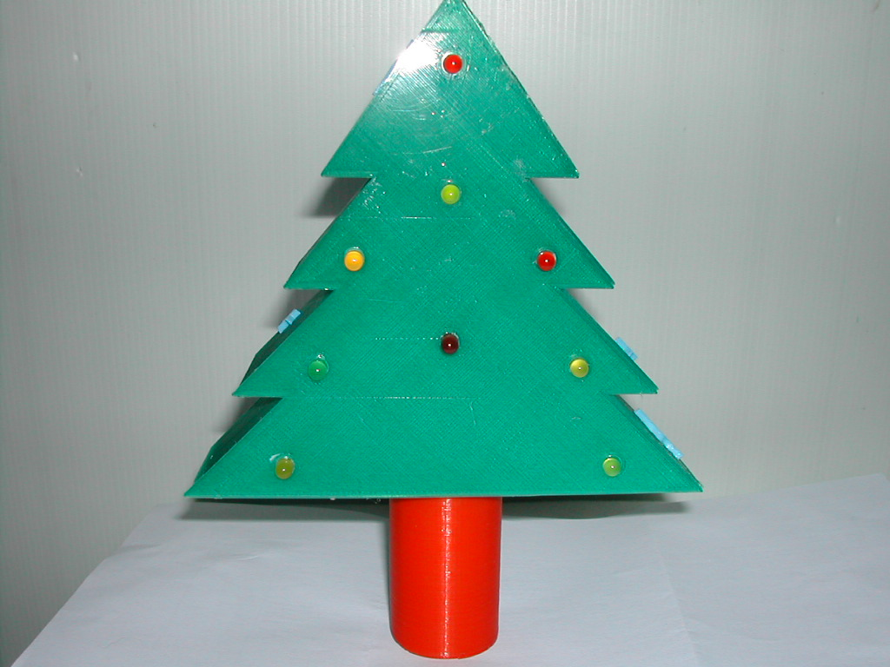
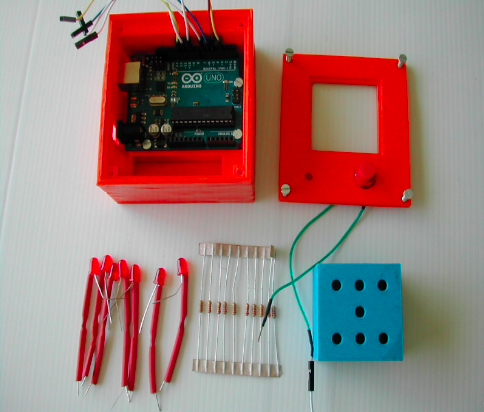

# Ateliers Jeunes

Ces ateliers, mis en place en 2015, ont permis la réalisation de mini-projets pour mettre en eouvre les bases de l'electronique et de la programmation.

### Sapin

Un sapin clignotant réalisé en 3D

### Dé électronique

Un dé electronique réalisé en 3D

## Fleur 

- Une fleur contrôlée avec un capteur de distance
- Une fleur contrôlée avec un capteur de luminosité
